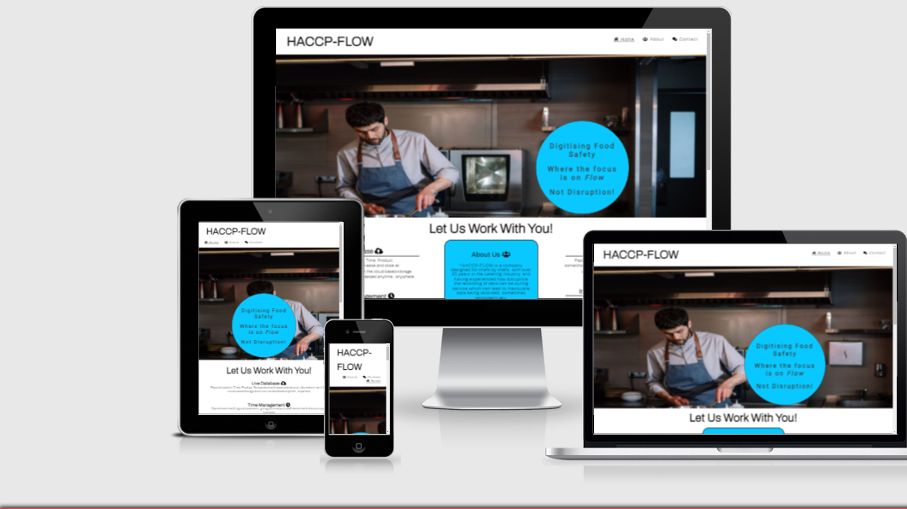
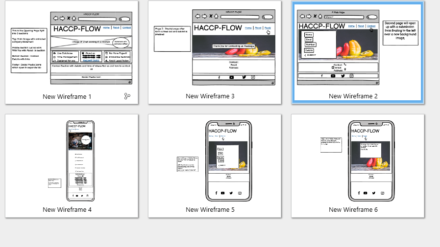
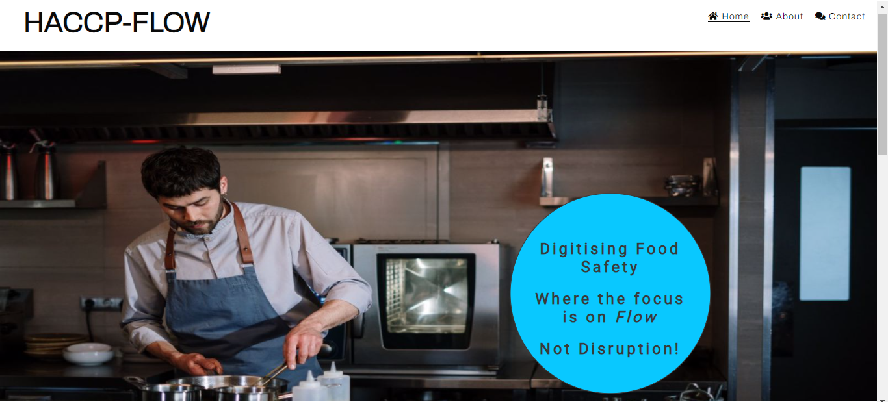
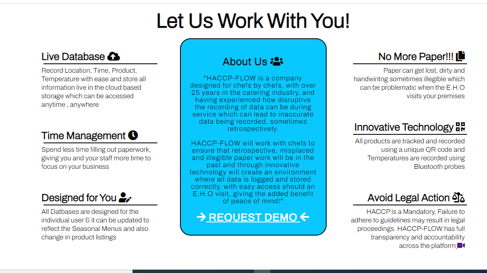
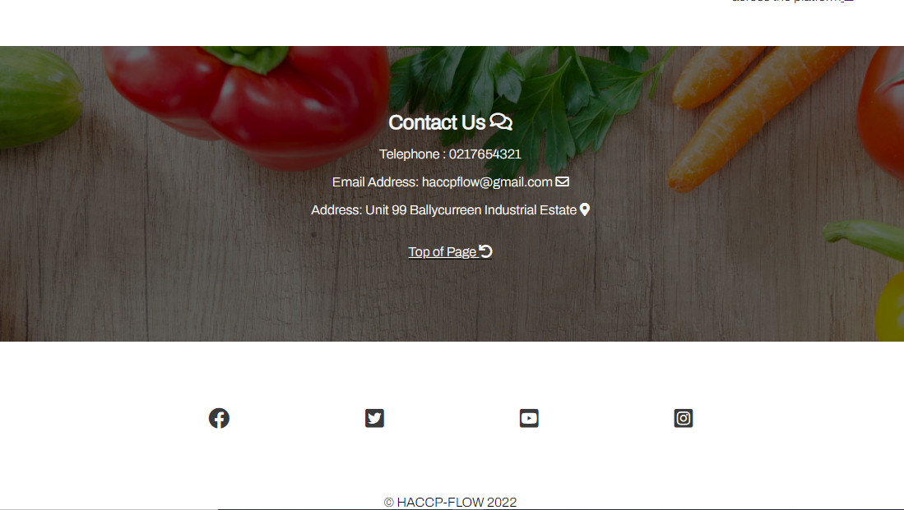
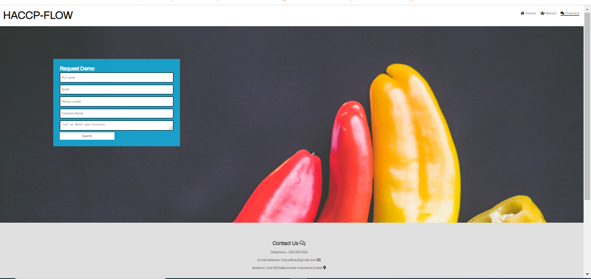

# HACCP-FLOW

## Welcome to <a href="https://peter-hennessy.github.io/HACCP-FLOW/index.html" target="_blank" rel="noopener">HACCP-FLOW</a> a digital food safety platform

The idea for my project comes from a business idea I am currently in the process of trying to create.
It is a cloud based digital food safety management system that is designed to meet the needs of the individual.
The design I have decided to go with is a clean, clear, simplistic platform. Which is relatable to my company idea. 
The concept for my project is a company I am in the process of creating, It is a company conceived through my own work practices as a head & market study with over 50 of my industry peers to design a cloud based digital food safety platform

# Contents

* [**User Experience UX**](<#user-experience-ux>)
    *  [User Stories](<#user-stories>)
    * [Wireframes](<#wireframes>)
    * [Site Structure](<#site-structure>)
    * [Design Choices](<#design-choices>)
    
* [**Features**](<#features>)
    * [**Home**](<#navigation-menu>)
         * [Home](<#home>)
         * [About-us](<#home>)
         * [Contact-Us](<#home>)
         * [Footer](<#home>)
         * [Request Demo](<#request-demo>)

* [**Request Demo Page**](<#request-demo>)
         
* [**Technologies Used**](<#technologies-used>)
* [**Testing**](<#testing>)
* [**Deployment**](<#deployment>)
* [**Credits**](<#credits>)
* [Content](<###content>)
    * [**Media**](<#media>)
*  [**Acknowledgements**](<#acknowledgements>)

# User Stories
- As a user I want to be able to see the main webpage heading first
- As a user I need to be able to see clearly where i want to go
- As a user I need to be able to see text and images clearly 
- As a user I need to be able to contact the company with relative ease
- As A user I need the page to load efficiently to add to the user experience
- 

# Wireframes

- For the wire frame design, I chose to have the main information on a single scroll page with link to the section via the Navigation bar menu
- The screen layout is for a pc screen and an iPhone
- As seen on the full width screen, the "About Us" section is designed to read left and right with a statement about who we are and how we can collaborate with you in the Middle
- On the Mobile phone screen all information falls to a vertical perspective with the About us section falling to the end [loving running Club-Ethos section]
- On the mobile image the Company statement with the focus on flow, floats to the left, but retains it animation of moving forward

 [Top](<#contents>)

# Site Structure
The static webpage is designed in three separate informative sections, the Main image with animation circle to draw the attention of the User with the nav bar in the upper right-hand corner. This Nav bar contains the  [Home](<#home>) which is underlined to let the user know what page they are currently on. Then followed by the  [About-us](<#about-us>) which when clicked will bring the user to the middle of the page. In the About section in the middle there is a [Request Demo](<#request-demo>) which will bring you to another page where the user will find a form, On completing this form the Submit button will be clicked which then will bring you to a reply page, And finally the [Contact-Us](<#contact-us>) which when clicked will bring you the bottom section of the page with email link & map  direction link. This structure is drafted in the [Wireframes](<#wireframes>) Section

 [Top](<#contents>)

# Design Choices 

- ### Typography
For my project I decided to choose two fonts, Archivo as the text font and Roboto as the contrasting heading font with a default font of Sans-Serif. 
* 'Archivo' The Reason I chose this contrasting style is because the reading text is clear for the user to see. 
* 'Roboto' is used for the heading text which looks  solid prominent and straight, which I feel adds a nice contrast when the user is reading the page

- ### Color Scheme
For this project I decided on a traditional color scheme of #0a0a0a which in a very _Dark Gray (mostly black)_ and #fff which is a _White_, and rgb(9,200,255) which is a shade of _Teal_ which adds a nice blast of fresh modern color in the section that needs to stand out, like the 'About us' section and also the 'Form' section. It makes the site look modern & fresh which is what I set out to do from the beginning. Both White and Black text contrast nicely with the shade of Teal. 
# [ADD COLOR CHART HERE ??]

 [Top](<#contents>)
# Features
### Navigation Menu
This is situated in the upper right hand corner of the across all three pages to create continuity across the platform. Starting left to right this includes the following:

- #### Home

This section has the landing Image with the Animated Circle cover text, this is created to draw the attention of the user to what the company does in a short brief text, but enough to draw curiosity of the user to look further

- #### About Us

The About Us section gives a detailed offering of what the company can offer with the Welcoming Statement "Let Us Work With You!!" This section contains a video link in the _Avoid Legal Action_ to explain the importance of correct HACCP . It also contains a link to the [Request Demo](<request-demo>) which can be seen below. 

- #### Contact Us

The Contact Us section contains all the relavent ways to contact us via Email, Telephone or Location with a Font Awesome link to re-direct the user to the desired option

- #### Footer
This section contains all Social Media Links which when selected will open in a separate page. The Social Media links are the to enhance the User Experience, They are set in a square Font Aawesome format to contrast other elements on the page and also adds a Clean design to the foot of the page 

- #### Request Demo
This section is embedded in the About Us Section, it has a contarsting color to the rest of the text and it is situated on a teal backround to stand out on the page. This link will redirect you to another page with a form to fill and submit

 [Top](<#contents>)
 
 # Request Demo Page
 
 
 
- ### Design
For this page I changed the backgorund landing image to add a sense of redirection and interaction, while still maintaining the Core Head & Footer Structure. A form is the palced to the left of the page again using the contrasting Teal Background Color

- ### Form
The Form has six text areas to fill, Name, Email, Phone Number, Company Name, Text Area & Submit with a Required Command in every area. The reason for this type of form is get as much information as possible from the User easily, again to make the Experience as easy as possible.
When clicking the Submit Button this will direct the User to another page with a  Reply message of receipt of the Enquiry

- ### Reply
The Reply Page is desinged with the similiar to the form page with a Thank you message t acknowledge receipt of request

 
 
# Technologies Used
* [HTML5](https://html.spec.whatwg.org/) - provides the content and structure for the website.
* [CSS](https://www.w3.org/Style/CSS/Overview.en.html) - provides the styling.
* [Balsamiq](https://balsamiq.com/wireframes/) - used to create the wireframes.
* [Gitpod](https://www.gitpod.io/#get-started) - used to deploy the website.
* [Github](https://github.com/) - used to host and edit the website.

 [Top](<#contents>)

# Testing

 [Top](<#contents>)

# Deployment

### **To deploy the project**
The site was deployed to GitHub pages. The steps to deploy a site are as follows:
  1. In the GitHub repository, navigate to the **Settings** tab.
  2. Once in Settings, navigate to the **Pages** tab on the left hand side.
  3. Under **Source**, select the branch to **master**, then click **save**.
  4. Once the master branch has been selected, the page will be automatically refreshed with a detailed ribbon display to indicate the successful deployment.

![GitHub pages deployed image HERE]

  The live link to the Github repository can be found here -  https://github.com/Peter-Hennessy/HACCP-FLOW

### **To create a local clone of this project**
The method from cloning a project from GitHub is below:

1. Under the repository’s name, click on the **code** tab.
2. In the **Clone with HTTPS** section, click on the clipboard icon to copy the given URL.
3. In your IDE of choice, open **GitHub Desktop**.
4. Change the current working directory to the location where you want the cloned directory to be made.
5. Press **clone**, and a local clone will be created

 [Top](<#contents>)

# Credits
### Content

* The font came from [Google Fonts](https://fonts.google.com/).
* The locator is embedded from [Google Maps](https://www.google.com/maps).
* The icons came from [Font Awesome](https://fontawesome.com/).
* The form structure was found on [W3 schools](https://www.w3schools.com/howto/howto_css_contact_form.asp)
* The inspiration for the Project page layout came from the [Love Running]
* [Balsamiq](https://balsamiq.com/wireframes/) was used to create the wireframes.

 [Top](<#contents>)

# Media
 * All Media Images were down loaded from [Pexel](https://www.pexels.com/) and formated to fit the screen size with [Photo Pad](https://www.nchsoftware.com/photoeditor/index.html)

 [Top](<#contents>)

# Acknowledgements
The site was completed as a Portfolio 1 Project piece for the Full Stack Software Developer (e-Commerce) Diploma at the [Code Institute](https://codeinstitute.net/). I would like to thank my Mentor [Precious Ijege](https://www.linkedin.com/in/precious-ijege-908a00168/) for his patience, inderstanding & guidance, Also Help from the Slack Community [Dave Bowers](#) for his help with a few issues I had. And last but certainly not least [Kasia Boguka](https://github.com/bezebee) for her help & guidance with the project

 [Top](<#contents>)

   
   
