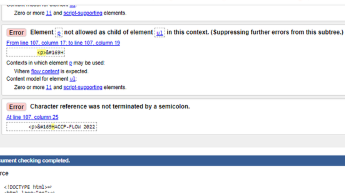
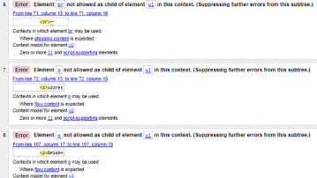
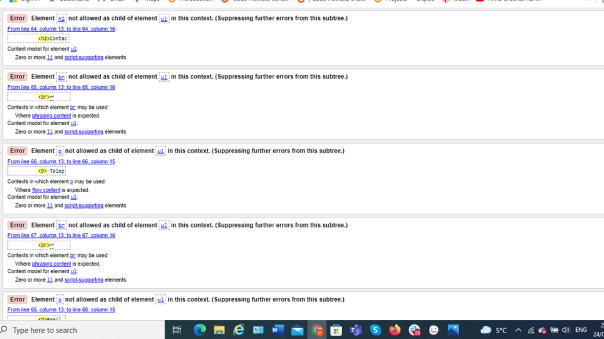
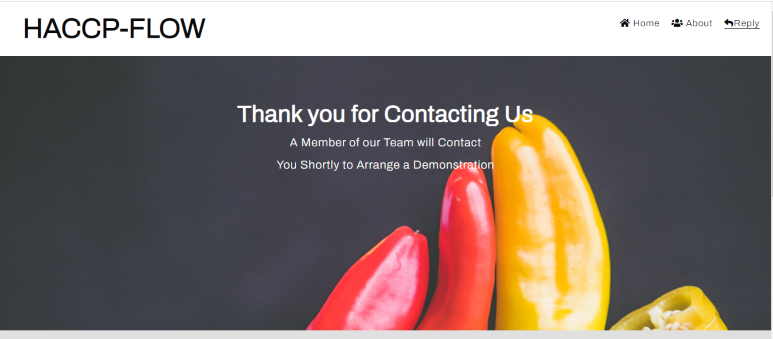

# Testing

## Bugs & Display Errors

- Corrected errors on all three pages ran validator test and post results below

# Bugs during project build

### During the process alot of the bugs I encountered were down to inexperience in coding

#### Table Formating on the **Request Demo** Page

   - I Refered to [W3 schools](https://www.w3schools.com/howto/howto_css_contact_form.asp)) and found useful information which helped with the design of the table

#### Creating a link to display a response to Form Validation

   - On reaching out to Slack I was given advise from [Dave Bowers](https://github.com/dnlbowers) and I was able to intergrate the advice to create a Form Validation Page 

#### Animation with the cover text on the Main Image

   - The Circle went oval shaped, but with the guidance of the **Love Running** I Managed to understand what was to be done to execute this. I used the animation  from the cover text and the circle from the ethos section, and modified them to fit my page

#### Images not displaying

   - This was down to inadequate file paths, but again through watching the tutorial I corrected the error

#### Creating the README.md file 

    - The major bug was **Merge Conflict** again down to be a novice, reached out to the Slack Community who offered advice to rectify this problem

## Code Validation

The HACCP-FLOW site has been thoroughly tested. All the code has been run through the [W3C html Validator](https://validator.w3.org/) and the [W3C CSS Validator](https://jigsaw.w3.org/css-validator/). some errors were found on the Home, Demo Request & Response pages. Corrected all Errors and retested, no errors were returned for all 3.

- Home Page

- Request Demo page

- Response page

The CSS validator results are below:

## Browser Compatibility

HACCP-Flow site was tested on the following browsers with no visible issues for the user.
Google Chrome, Microsoft Edge, Safari and Mozilla Firefox. Appearance, Functionality, and Responsiveness were consistent throughout for a range of device sizes and browsers.

## Responsiveness Test

* The responsive design tests were carried out manually with [Google Chrome DevTools](https://developer.chrome.com/docs/devtools/) and [Responsive Design Checker](https://www.responsivedesignchecker.com/).

|        | Moto G4 | Galaxy S5 | iPhone 5 | iPad | iPad Pro | Display <1200px | Display >1200px |
|--------|---------|-----------|----------|------|----------|-----------------|-----------------|
| Render | pass    | pass      | pass     | pass | pass     | pass            | pass            |
| Images | pass    | pass      | pass     | pass | pass     | pass            | pass            |
| Links  | pass    | pass      | pass     | pass | pass     | pass            | pass            |

* Note: On Larger monitors the Landing page image repeated, I added css 'Background  no-repeat command to fix bug'

# Testing User Stories

- ### As a user I want to be able to be drawn into the page

  - When the page is opened by the User they are drawn to a familiar relatable image, with an animated one-line statement outlining what HACCP-FLOW can offer, moving towards them

    

- ### As a user I need to be able to see clearly where I want to go

  - The User will be introduced to the familiar layout with the company name in the upper left-hand side and the Navigation bar in the upper right-hand side. The Display page name has an underline, to let the user know which page thay are on.

   - On clicking the desired icon, they will be brought to the page section with Heading such as _About Us_ & _Contact us_ with clear information there in to enable them to navigate further.

 

- ### As a user I need to be able to see text and images clearly

  - The User will see that the Text is Clear & Concise with adequate letter spacing. The text is contrasted well with Three colors _Dark Gray_ , _White_ & _Teal_

  

- ### As a user I need to be able to contact the company with relative ease through social media or alternative links

  - The user can contact HACCP-FLOW via Social Media icons on the base of the page. There is an email link in the contact section as is the Location icon for directions which was downloaded from Google Maps

 

- ### As a user I need to be able to get the solution to my questions

  - In the About Us section the User can see clearly what HACCP-FLOW has to offer them in the form of factual short statements that again will have the User interested in finding out more and contacting them via the _Request Demo Link_

## Additional Testing

### Responsive Behaviour on Various Devices

- The Platform was tested on [Am I Responsive](http://ami.responsivedesign.is/) across different screen sizes and different Platform Models

### Lighthouse

#### Desktop

#### Mobile

The site was also tested using [Google Lighthouse](https://developers.google.com/web/tools/lighthouse) in Chrome Developer Tools to test each of the pages for:

- Performance - How the page performs whilst loading.
- Accessibility - Is the site accessible for all users and how can it be improved.
- Best Practices - Site conforms to industry best practices.
- SEO - Search engine optimisation. Is the site optimised for search engine result rankings.

### _I found doing this in Incognito browser window, gave a more accurate result without background interference_

### Peer review

In addition to the above testing the site was put out for review by peers in the Catering Industry and peers in the Slack Community. The results highlighted some minor details which had a positive impact on the page, the Request Demo link being an example, by replacing it in a different section, resizing also it makes the UX more straight forward and user friendly.

Return to [README.md](./README.md#testing).

[Top](#testing)
