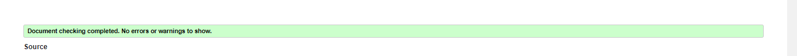
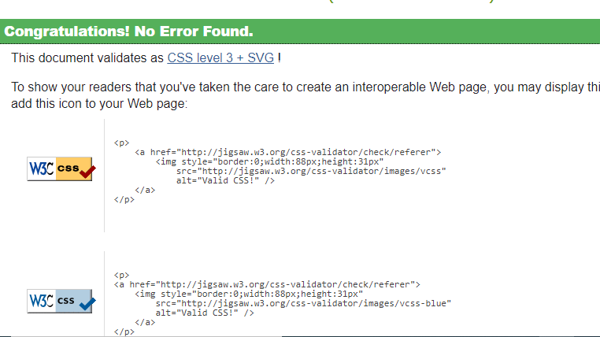
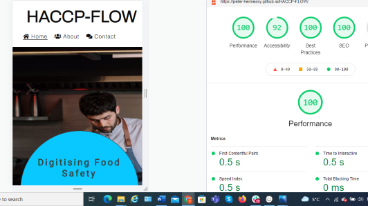
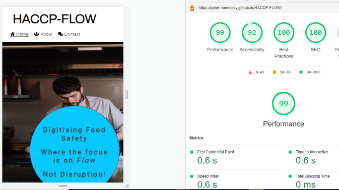

# Testing

## Code Validation

The HACCP-FLOW site has been thoroughly tested. All the code has been run through the [W3C html Validator](https://validator.w3.org/) and the [W3C CSS Validator](https://jigsaw.w3.org/css-validator/). some errors were found on the Home, Demo Request & Response pages. Corrected all Errors and retested, no errors were returned for all 3.

- Home Page

- Request Demo page

- Response page

The CSS validator results are below:

## Browser Compatibility

HACCP-Flow site was tested on the following browsers with no visible issues for the user.
Google Chrome, Microsoft Edge, Safari and Mozilla Firefox. Appearance, Functionality, and Responsiveness were consistent throughout for a range of device sizes and browsers.

# Testing User Stories

- As a user I want to be able to be drawn into the page

  - When the page is opened by the User and they are drawn to a familiar image, and the one-line statement outlining what HACCP-FLOW can offer

    

- As a user I need to be able to see clearly where I want to go

  - The User will be introduced to the familiar layout with the company name in the upper left-hand side and the Navigation bar in the upper right-hand side. The Display page name has an underline, to let the user know which page thay are on.
  - On clicking the desired icon they will be brought to the page section with Heading such as _About Us_ & _Contact us_ with clear information there in to enable them to navigate further.

On clicking the desired icon they will be brought to the page section with Heading such as _About Us_ & _Contact us_ with clear information there in to enable them to navigate further.

     

- - As a user I need to be able to see text and images clearly
- The User will see that the Typography is Clear & Concise with adequate letter spacing. The text is contrasted well with Three colors and _Dark Gray_ _White_ & _Teal_

     

- - As a user I need to be able to contact the company with relative ease through social media or alternative links

    - The user can contact HACCP-FLOW via Social Media icons on the base of the page. There is an email link in the contact section as is the Location icon for directions which was downloaded from Google Maps

     

- - As a user I need to be able to get the solution to my questions

    - In the About Us section the User can see clearly what HACCP-FLOW has to offer them in the form of factual short statements that again will have the User interested in finding out more and contacting them via the _ Request Demo Link_

## Additional Testing

### Lighthouse

#### Desktop

#### Mobile

The site was also tested using [Google Lighthouse](https://developers.google.com/web/tools/lighthouse) in Chrome Developer Tools to test each of the pages for:

- Performance - How the page performs whilst loading.
- Accessibility - Is the site accessible for all users and how can it be improved.
- Best Practices - Site conforms to industry best practices.
- SEO - Search engine optimisation. Is the site optimised for search engine result rankings.

### _I found doing this in Incognito browser window, gave a more accurate result with backing interference_

### Peer review

In addition to the above testing the beta version of the site was put through its paces by peers, both in the software development field and outside. The results highlighted responsive design weakness for a type of mobile device that was rectified with minor CSS amendments. There were also minor spelling and grammar errors that have since been fixed.

Back to [README.md](./README.md#testing).
